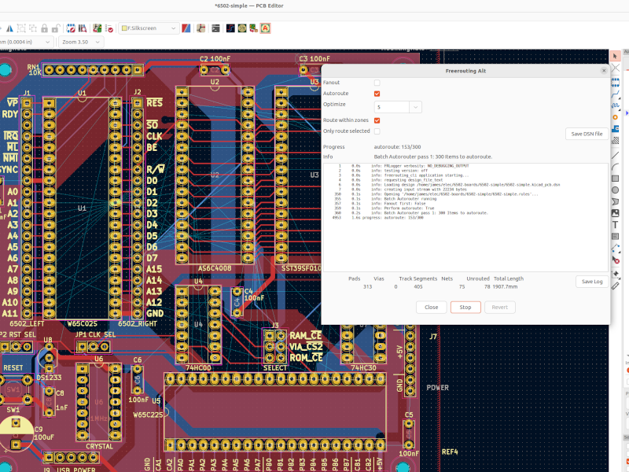

# kicad-freerouting-plugin-alt
An alternative **[freerouting](https://github.com/freerouting/freerouting)** plugin for kicad, 
using a modifed **[command line verion of freerouting](http://repo.hu/projects/freerouting_cli/)**.

This allows freerouting to run without opening a seperate application window. Instead, the kicad pcb
editor is updated with the new traces as freerouting runs.

The plugin window can control whether or not to run the freerouting fanout, autoroute, or number of
postroute optimize passes.

Futhermore, an alternative dsn exporter is provided. This can be used to
* Route within zones (don't export filled zones, so adequate width traces are routing instead)
* Only route selected (select components or pads before opening plugin, then only route traces between
those pads)
* Run optimize on a routed board[^1]

The call to freerouting can be cancelled at any time. The (partial or full) result can be undone with
the revert button.

## Requirements

This has been developed on an ubuntu machine. It has not been tested on Windows or MacOS.

* Kicad version 7.0
* java, version 1.9, executable installed and available (this may be an issue if you installed kicad
through snap)
* wx python bindings installed (should be a requirement for kicad in any case)

[^1] There appears to be rounding errors for traces in the built in dsn exporter

